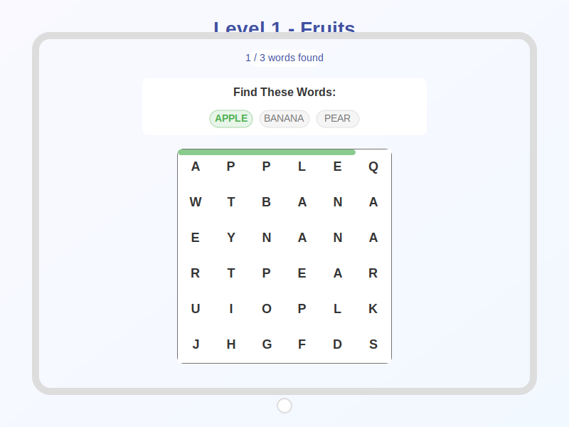

# Word Search Game

A responsive Word Search game that works on both mobile devices (touch interaction) and PC (mouse interaction).

## Features

- Interactive word search puzzle game
- Responsive design for both mobile and desktop
- Multiple difficulty levels 
- Word highlighting when found
- Progress tracking
- Smooth transitions between game states

## Game Flow

1. **Start Screen**: Displays a welcome screen with game logo and instructions
2. **Level 1 (Easy)**: Simple 6x6 grid with fruit-themed words placed horizontally and vertically
3. **Level 2 (Medium)**: Larger 8x8 grid with animal-themed words placed in multiple directions

## Tech Stack

- React
- Styled Components
- Mobile-first design

## Installation and Running

1. Clone this repository
2. Install dependencies:
```
npm install
```
3. Start the development server:
```
npm start
```
4. Open your browser to `http://localhost:3000`

## How to Play

1. Find the hidden words in the grid
2. Tap/click and drag to select letters in a straight line (horizontal, vertical, or diagonal)
3. When a correct word is found, it will be highlighted on the grid and marked as found in the word list
4. Complete all words to advance to the next level

## Screenshots

The game includes three main screens:

1. **Start Screen** - Welcome screen with game instructions
   
   
2. **Level 1** - Easy level with a 6x6 grid and fruit-themed words
   
   
3. **Level 2** - Medium level with an 8x8 grid and animal-themed words
   

## Responsive Design

The game is designed to work well on:
- Mobile phones (touch interaction)
- Tablets
- Desktop computers (mouse interaction)

## Future Enhancements

- More levels with increasing difficulty
- Different themes and word categories
- Time-based gameplay
- Score system
- Sound effects and animations 